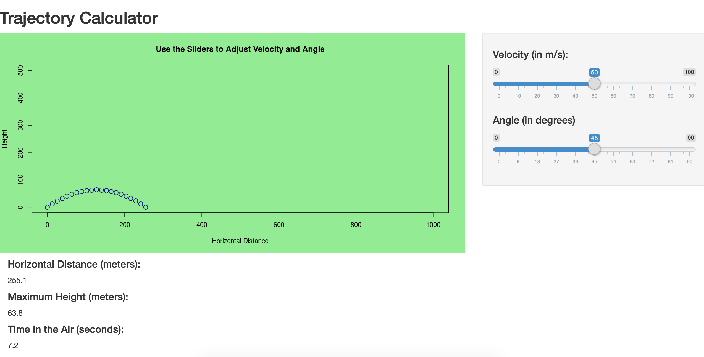

Trajectory Calculator App
========================================================
author: David Harter
date: December 11, 2018
autosize: true

App is accessible at:
https://dtharter.shinyapps.io/trajectorycalculator/

Code is located at:
https://github.com/dtharter/DevelopingDataProductsShinyApp


Background
========================================================

Due to the laws of physics, a projectile launched into the air will travel in a predictable way.  Horizontally, it will travel at a constant rate, whereas vertically it will decelerate due to gravity before changing direction and coming back down.

This app serves as a simple tool for calculating the horizontal distance, maximum height, and time in the air, given a certain angle and initial velocity.  The algorithm ignores air resistance, but it is still fairly accurate for most purposes involving small projectiles.

Functionality
========================================================

The trajectory calculator app uses sliders that allow users to adjust angle (degrees) and initial velocity (meters/second).  The app then returns the final horizontal distance, maximum vertical height, and total time spent in the air.

In the next slide, we show some code that illustrates the calculations for distance, height and time.  These are the exact formulas the app uses to compute these figures.

Also included is a graph showing the trajectory at 21 different points.  This allows the user to see how the path of the projectile physically changes as the velocity and angle parameters change.

Code
========================================================


```r
velocity <- 50; angle <- 65;

horiz <- 2 * velocity^2 * sin(angle*pi/180) * cos(angle*pi/180)/9.8
ymax <- 0.5 * (velocity * sin(angle*pi/180))^2 / 9.8
finTime <- 2 * velocity * sin(angle*pi/180) / 9.8
```

```
[1] "Horizontal distance (meters): 195.4"
```

```
[1] "Maximum height (meters)     : 104.8"
```

```
[1] "Time in the Air (seconds)   : 9.2"
```

Interface
========================================================


